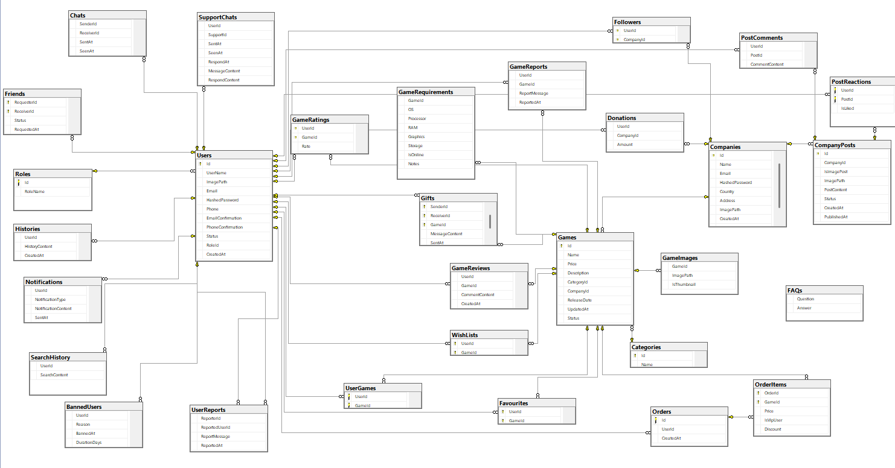

# 🎮 Game Store & Social Platform - SQL Server Project

Welcome to my full-fledged **Game Store** database project inspired by platforms like **Steam**, but with extended **social media features**. This project is part of my backend development training, using **SQL Server** to design and implement a real-world relational database model.

---

## 📌 Project Overview

The project simulates a complete online game store experience with:

- 🎮 Game purchasing and management
- 🏢 Company (Publisher) profiles with events and posts
- 💬 Social interactions like comments, likes/dislikes
- 🎁 Gifting, wishlists, favorites
- 📩 Messaging and support system
- 🚫 Reporting and moderation system

---

## 🧱 Database Highlights

✅ Designed using **30 normalized relational tables** in SQL Server  
✅ Covers key features of a **real e-commerce & social media hybrid platform**

---

## 🧩 Key Features & Modules

### 👤 User Management
- Register, login, and manage profiles
- Roles (Admin, User, Moderator, Support)

### 🕹️ Game System
- Games catalog
- Game purchases
- Favorites & Wishlists
- Game reviews and ratings

### 🧾 Orders
- Track game purchases per user
- Order details with timestamps

### 🧑‍🤝‍🧑 Social Media Features
- Users can:
  - Comment on game posts/events
  - Like/Dislike posts
  - Report games or users
  - Follow companies (publishers)

### 📢 Publishers & Posts
- Companies (publishers) can:
  - Publish posts about current or upcoming games
  - Create events tied to their games
  - Engage with followers

### 💌 Messaging & Support
- Private messaging between players
- Contact support system for help
- Moderators handle reports and take action

### 🎁 Gifting System
- Users can send games as gifts to others

### 🚨 Reporting & Moderation
- Users can report:
  - Other users
  - Games
- Admins and moderators review reports and take appropriate actions
- Blocking and warning system

---

## 🔧 Tech Stack

| Layer          | Technology     |
|----------------|----------------|
| Database       | SQL Server     |
| Backend Logic  | SQL Procedures, Functions, Views |

## 📷 ERD & Schema Preview

---

